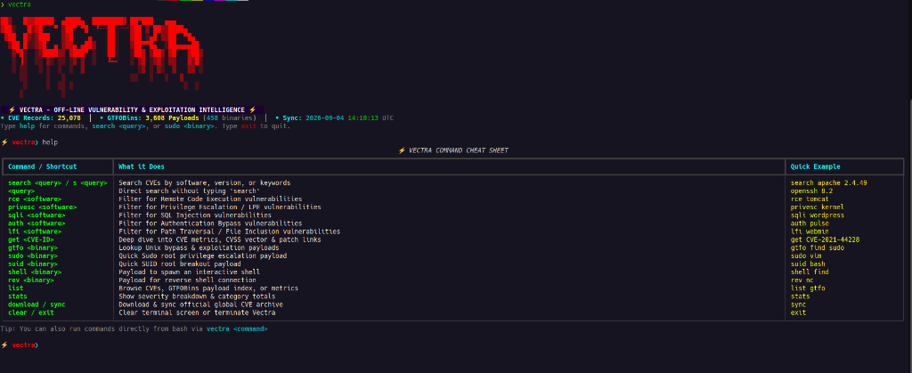

<div align="center">

# ⚡ VECTRA
### High-Performance Offline CVE & GTFOBins Intelligence Search Engine

[](https://python.org)
[](https://sqlite.org/fts5.html)
[](https://www.cve.org)
[](https://gtfobins.github.io)
[](https://www.docker.com)
[](LICENSE)


```
██▒   █▓▓█████  ▄████▄  ████████▓ ██▀███   ▄▄▄      
▓██░   █▒▓█   ▀ ▒██▀ ▀█  ╚══██╔══╝▓██ ▒ ██▒▒████▄    
 ▓██  █▒░▒███   ▒▓█    ▄    ██║   ▓██ ░▄█ ▒▒██  ▀█▄  
  ▒██ █░░▒▓█  ▄ ▒▓▓▄ ▄██▒   ██║   ▒██▀▀█▄  ░██▄▄▄▄██ 
   ▒▀█░  ░▒████▒▒ ▓███▀ ░   ██║   ░██▓ ▒██▒ ▓█   ▓██▒
   ░ ▐░  ░░ ▒░ ░░ ░▒ ▒  ░   ╚═╝   ░ ▒▓ ░▒▓░ ▒▒   ▓▒█░
   ░ ░░   ░ ░  ░  ░  ▒              ░▒ ░ ▒░  ▒   ▒▒ ░
     ░░     ░   ░                 ░░   ░   ░   ▒    
      ░     ░  ░░ ░                             ░  ░ 
     ░          ░                                    
```

**VECTRA** is an offline-first terminal vulnerability research and exploitation engine built for penetration testers, security analysts, red teamers, and CTF players.

</div>

---

## 📸 Terminal Interface Preview

<div align="center">
  
</div>

---

## ⚡ Core Capabilities

- **🚀 Sub-Millisecond Search**: Powered by SQLite FTS5 with BM25 ranking across descriptions, titles, affected products, software versions, and CWEs.
- **📦 Pre-Loaded & Offline**: Over **25,000+ real CVE records** and **3,608 GTFOBins exploitation payloads** indexed directly on your local machine.
- **🎯 Service & Version Matching**: Direct, fuzzy, and structured queries by software name and version (e.g. `apache 2.4.49`, `openssh 8.2p1`, `vsftpd 2.3.4`).
- **🛡️ Vulnerability Classification**: Instant filtering by vulnerability category (`rce`, `privesc`, `sqli`, `lfi`, `auth-bypass`, `memory-corruption`, `ssrf`, `dos`).
- **⚔️ GTFOBins Integration**: Complete offline database of Unix binaries with ready-to-run bypass commands for **Sudo**, **SUID**, **Capabilities**, **Interactive Shells**, **Reverse Shells**, and **File Read/Write**.
- **🎨 Responsive Cyberpunk Terminal**: Visual CVSS heat-meters (`[██████████] 10.0 CRITICAL`), adaptive word-wrapping, syntax highlighting, and tab-autocompletion.
- **🐳 Docker Ready**: Zero-configuration container support with persistent volume caching.

---

## 🚀 Quick Start

### 1. Installation

Clone the repository and install into your user environment:

```bash
git clone https://github.com/addisabrham36-boop/vectra.git
cd vectra

# Install dependencies and link executable globally
pip install -e .
```

You can now run `vectra` from **any directory** in your terminal!

---

### 2. Launching the Interactive Shell

Simply type:

```bash
vectra
```

Inside the interactive console:

```text
⚡ vectra❯ search apache 2.4.49
⚡ vectra❯ rce tomcat
⚡ vectra❯ privesc kernel
⚡ vectra❯ sudo vim
⚡ vectra❯ suid bash
⚡ vectra❯ get CVE-2021-44228
⚡ vectra❯ stats
```

---

## 📖 Command Reference Cheat Sheet

| Command / Shortcut | What it Does | Example |
| :--- | :--- | :--- |
| **`search <query>` / `s <query>`** | Search CVEs by software, version, or keywords | `search apache 2.4.49` |
| **`<query>`** | Direct search without typing 'search' | `openssh 8.2` |
| **`rce <software>`** | Filter for Remote Code Execution vulnerabilities | `rce tomcat` |
| **`privesc <software>`** | Filter for Privilege Escalation / LPE vulnerabilities | `privesc kernel` |
| **`sqli <software>`** | Filter for SQL Injection vulnerabilities | `sqli wordpress` |
| **`auth <software>`** | Filter for Authentication Bypass vulnerabilities | `auth pulse` |
| **`lfi <software>`** | Filter for Path Traversal / File Inclusion vulnerabilities | `lfi webmin` |
| **`get <CVE-ID>`** | Deep dive into CVE metrics, CVSS vector & advisory links | `get CVE-2021-44228` |
| **`gtfo <binary> [type]`** | Lookup Unix bypass & exploitation payloads | `gtfo find sudo` |
| **`sudo <binary>`** | Quick Sudo root privilege escalation payload | `sudo vim` |
| **`suid <binary>`** | Quick SUID root breakout payload | `suid bash` |
| **`shell <binary>`** | Payload to spawn an interactive shell | `shell find` |
| **`rev <binary>`** | Payload for reverse shell connection | `rev nc` |
| **`list [cves\|gtfo\|stats]`** | Browse CVE records, GTFOBins payload index, or metrics | `list gtfo` |
| **`stats`** | Show severity breakdown & category totals | `stats` |
| **`download / sync`** | Download & sync official global CVE archive (386,000+ CVEs) | `sync` |
| **`help`** | Display command cheat sheet and usage guide | `help` |
| **`clear / exit`** | Clear terminal screen or terminate Vectra | `exit` |

---

## 💻 Direct CLI Usage (Non-Interactive)

You can run any command directly from your shell scripts or terminal:

### Search by Service & Version:
```bash
vectra search "apache 2.4.49"
vectra search "vsftpd 2.3.4"
vectra search "seaweedfs" --type privesc
```

### Search by Vulnerability Type:
```bash
vectra search --type rce --severity CRITICAL
vectra search "sudo" --type privesc
vectra search --type sqli
```

### GTFOBins Privilege Escalation Payloads:
```bash
# Sudo root command execution for 'vim'
vectra gtfo vim -t sudo

# SUID exploitation for 'find'
vectra gtfo find -t suid

# Reverse shell for 'bash'
vectra gtfo bash -t reverse-shell

# List all exploit categories
vectra gtfo-list
```

### Inspect Technical Details of a CVE:
```bash
vectra get CVE-2021-44228
vectra get CVE-2024-6387
vectra get CVE-2022-0847
```

---

## 🐳 Docker Deployment

Run Vectra in completely isolated Docker containers with persistent caching:

### Interactive Terminal via Docker:
```bash
docker compose run --rm vectra-cli
```

### REST API Service:
```bash
docker compose up -d vectra-api
# REST API endpoints available at http://127.0.0.1:8000
# OpenAPI Docs: http://127.0.0.1:8000/docs
```

---

## 🏛️ Architecture & Offline Storage

- **Local Storage Path**: `~/.local/share/vectra/cves.db`
- **Environment Variable**: `VECTRA_DATA_DIR=/custom/path`

---

## 🛡️ License & Acknowledgements

- **License**: Released under the [MIT License](LICENSE).
- **Data Sources**:
  - [CVEProject / cvelistV5](https://github.com/CVEProject/cvelistV5) (Official MITRE / CVE List v5)
  - [GTFOBins](https://gtfobins.github.io) (Curated Unix Binaries Privilege Escalation Project)

<div align="center">
  <b>Built for security professionals, ethical hackers, and CTF champions.</b>
</div>
